# Kiwi Extra Enhancement Suite (KEES)

A browser extension that adds enhanced features Xenforo chat and forum pages.

## Features

**Chat:**
- Extended format bar (Bold, Italic, Underline, Strikethrough, Center, Size, Code, URL, Color, Rainbow, Image, Bullets)
- WYSIWYG editor for visual BBCode editing (including center and size support)
- Size picker with preset sizes
- Custom emotes and image blacklist
- Watched users highlighting
- YouTube link titles
- Double-click to edit messages
- Zipline upload integration (with EXIF stripping)
- Mention notifications
- @everyone expansion (configurable user list in settings)
- Mention autocomplete sorted by recent activity
- Hides official chat toolbar (replaced by extension's enhanced toolbar)
- Whisper box with per-user conversation tabs, unread badges, and draggable/resizable UI
- Global whisper box across all site pages (sends via background relay to chat tab)
- Whisper persistence with configurable retention (messages per conversation)
- Option to hide whispers from main chat
- Configurable scrollback limit (up to 5000 messages)

**Forum:**
- Featured posts consolidation
- User muting
- Disruptive guest auto-hiding
- Reaction ratio filter
- Attachment EXIF stripping

**Profiles:**
- Forum activity analysis

**Homepage:**
- Hide chat widget
- Remove sponsored content

## Installation

**Chrome/Chromium:**
1. Clone the repo
2. Run `cd extension && npm install && npm run build`
3. Open `chrome://extensions/`, enable Developer mode
4. Click "Load unpacked" and select the `extension` folder

**Firefox:**
1. Clone the repo
2. Run `cd extension && npm install && npm run build`
3. Open `about:debugging#/runtime/this-firefox`
4. Click "Load Temporary Add-on" and select `extension/manifest.json`

## Screenshots

### Extension Settings

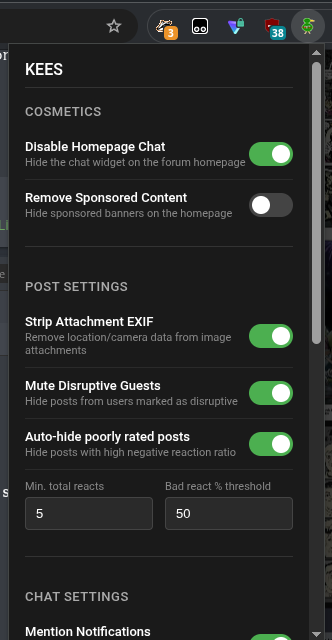
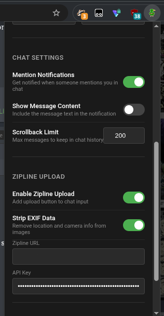
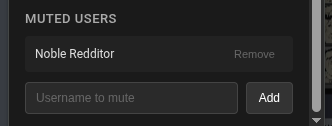

### Chat Features

**WYSIWYG Editor:**
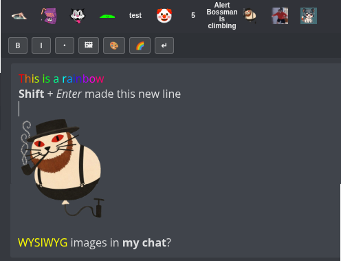

**Raw BBCode Mode:**
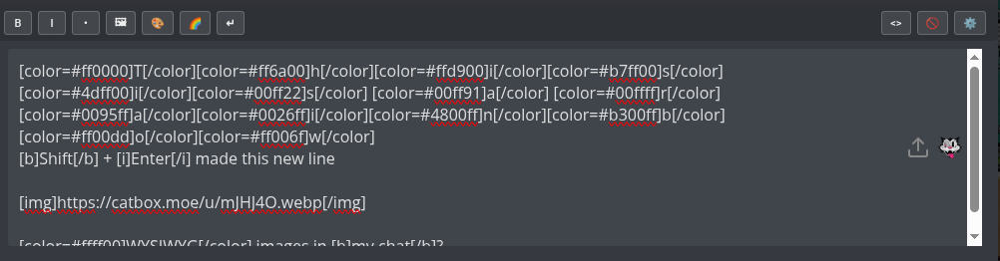

**Custom Emotes:**
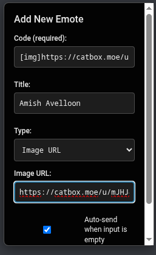

**Image Bans, Custom Emotes, Bar Activation, & Zipline Upload:**
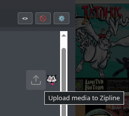

**YouTube Link Titles:**
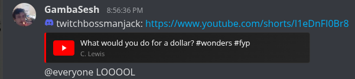

### Forum Features

**Disruptive Guest Blocking:**
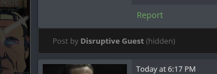

### Featured Posts Consolidation

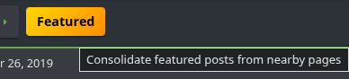
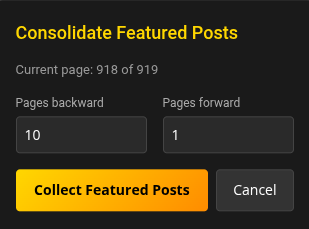
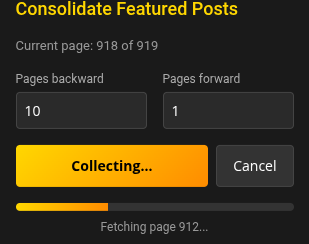
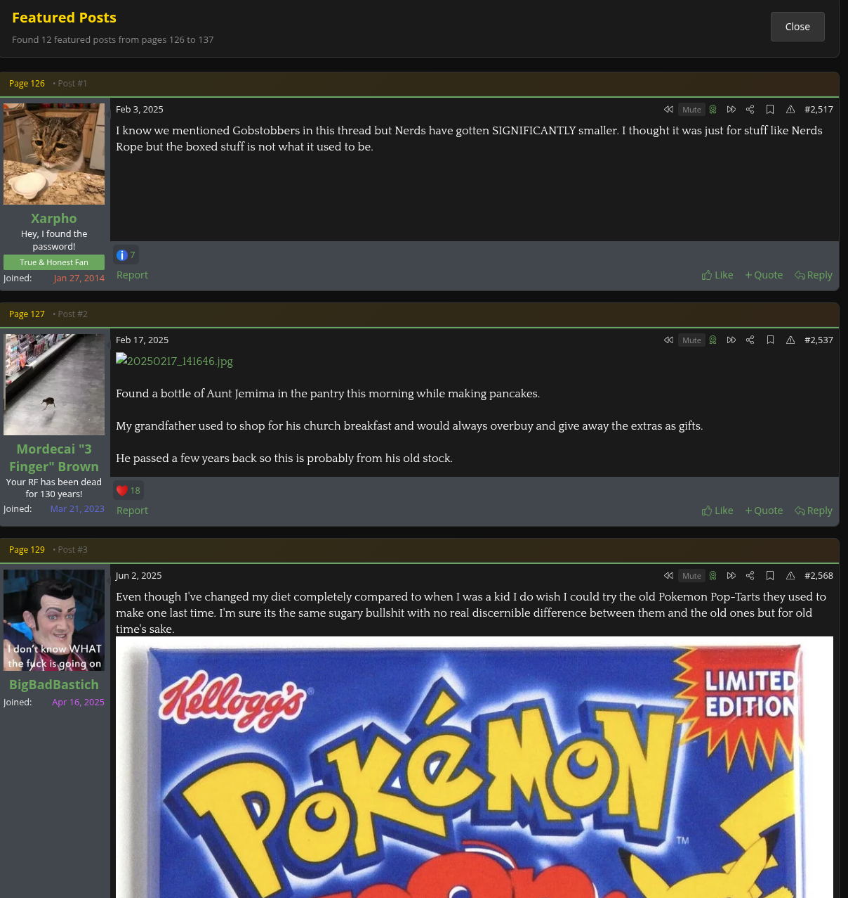

### User Profile Analytics

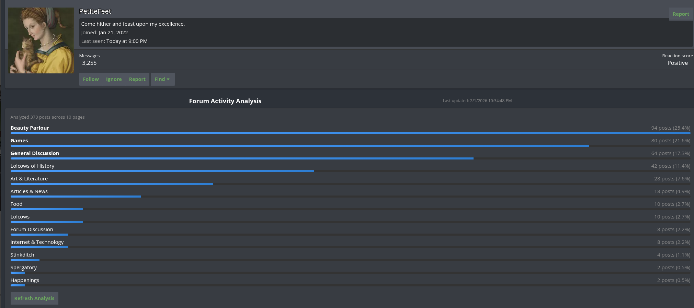

---

## Legacy: Sneedchat Enhancer (Tampermonkey Userscript)

> **Note:** This userscript has been superseded by the KEES browser extension above, which includes all the same features plus many more. The userscript is no longer actively maintained.

A Tampermonkey userscript that adds enhanced features to Sneedchat, including quick emote insertion, text formatting tools, and improved chat input functionality.

### Features

- **Quick Emote Bar**: Easy access to frequently used emotes with single-click insertion
- **Format Toolbar**: BBCode formatting buttons for text styling (bold, italic, underline, etc.)
- **Color Picker**: Visual color selection tool for colored text
- **Smart Input Resizing**: Auto-expanding chat input that adjusts to content
- **Shift+Enter Support**: Send messages with Enter, add newlines with Shift+Enter
- **Shift+Click Emotes**: Hold Shift while clicking emotes to insert without auto-sending
- **Better Lost Connection Handling**: Helps prevent the client from eating messages when connection is lost

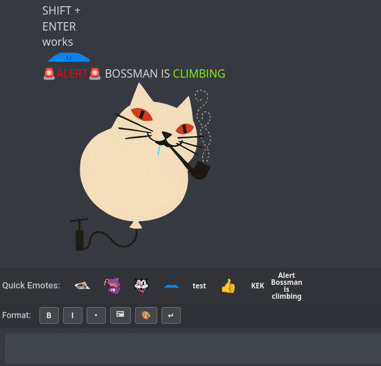
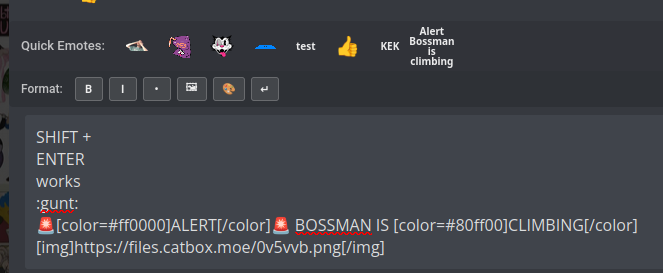
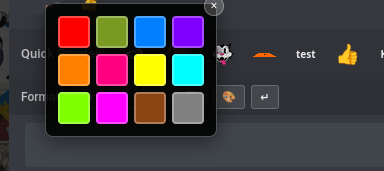

### Installation

#### Prerequisites

1. Install [Tampermonkey](https://www.tampermonkey.net/) or [Violentmonkey](https://violentmonkey.github.io/):
   - **Tampermonkey**: [Chrome/Edge/Brave](https://chrome.google.com/webstore/detail/tampermonkey/dhdgffkkebhmkfjojejmpbldmpobfkfo) | [Firefox](https://addons.mozilla.org/en-US/firefox/addon/tampermonkey/) | [Safari](https://apps.apple.com/us/app/tampermonkey/id1482490089)
   - **Violentmonkey**: [Chrome/Edge](https://chrome.google.com/webstore/detail/violentmonkey/jinjaccalgkegednnccohejagnlnfdag) | [Firefox](https://addons.mozilla.org/en-US/firefox/addon/violentmonkey/)

#### Quick Install

Click this link to install directly:

**[Install Sneedchat User Bar](https://raw.githubusercontent.com/ClaudetteTheGreat/sneed-bar/user-bar-v3.5.0/user-bar/loader.user.js)**

Your userscript manager will prompt you to install. Click "Install" to confirm.

#### Manual Installation

1. Open Tampermonkey/Violentmonkey dashboard
2. Click the "+" tab to create a new script
3. Delete any default content
4. Copy the contents of [`old-greasemonkey-scripts/user-bar/loader.user.js`](old-greasemonkey-scripts/user-bar/loader.user.js) and paste it
5. Click **File > Save** or press `Ctrl+S` (or `Cmd+S` on Mac)
6. The script will automatically run on Sneedchat pages

### Usage

#### Emote Bar
- Click any emote to insert it into the chat input
- If the input only contains the emote code, it will auto-send
- Hold **Shift** while clicking to insert without auto-sending

#### Format Toolbar
- **B**: Bold text `[b]text[/b]`
- **I**: Italic text `[i]text[/i]`
- **U**: Underline text `[u]text[/u]`
- **Color Palette**: Opens color picker for colored text

Select text first to wrap it with formatting, or click to insert empty tags.

#### Keyboard Shortcuts
- **Enter**: Send message
- **Shift+Enter**: Add new line without sending
- **Escape**: Close color picker or cancel edit

### Configuration

#### Managing Emotes

Click the **gear icon** in the format bar to open the Emote Manager:

- **Add**: Click "+ Add New Emote" to create custom emotes
- **Edit**: Modify existing emotes (code, image URL, emoji, or text)
- **Delete**: Remove emotes you don't need
- **Import/Export**: Backup and restore your emote collection as JSON
- **Reset**: Restore default emotes

#### Image Blacklist

Click the **ban icon** to manage blacklisted images. Blacklisted image URLs won't appear in the emote bar.

---

## Additional Scripts

### I LOVE CHRIS. YES I DO. (`other-scripts/ILOVECHRIS-YESIDO.js`)

A Tampermonkey userscript that automatically clicks the like button on Chris' DLive with random intervals.

**Features:**
- Automatically clicks the like button with random delays (0.1-0.7 seconds)
- Pauses for 5 seconds after every 190 clicks to avoid detection
- Automatically clicks "Close" button on rate limit popups
- Stops permanently when like count reaches 6,000
- Requires login to DLive to function

**Installation:**
1. Install Tampermonkey (see prerequisites above)
2. Open Tampermonkey dashboard
3. Create a new script
4. Copy contents of `other-scripts/ILOVECHRIS-YESIDO.js` and paste it into the editor
5. Save the script
6. Navigate to https://dlive.tv/djheartbeatz (must be logged in)
