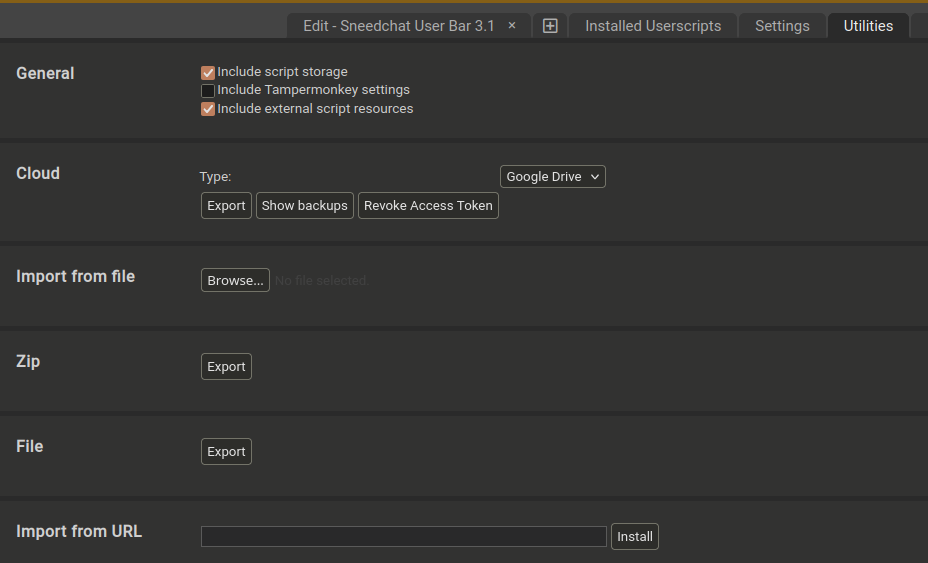
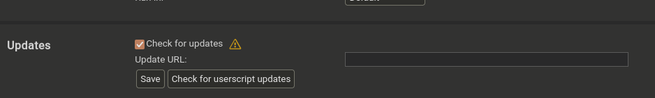

# Sneedchat Enhancer

A Tampermonkey userscript that adds enhanced features to Sneedchat, including quick emote insertion, text formatting tools, and improved chat input functionality.

## Features

- **Quick Emote Bar**: Easy access to frequently used emotes with single-click insertion
- **Format Toolbar**: BBCode formatting buttons for text styling (bold, italic, underline, etc.)
- **Color Picker**: Visual color selection tool for colored text
- **Smart Input Resizing**: Auto-expanding chat input that adjusts to content
- **Shift+Enter Support**: Send messages with Enter, add newlines with Shift+Enter
- **Shift+Click Emotes**: Hold Shift while clicking emotes to insert without auto-sending
- **Better Lost Connection Handling**: Helps prevent the client from eating messages when connecton is lost
  

## Installation

### Prerequisites

1. Install [Tampermonkey](https://www.tampermonkey.net/) or [Violentmonkey](https://violentmonkey.github.io/):
   - **Tampermonkey**: [Chrome/Edge/Brave](https://chrome.google.com/webstore/detail/tampermonkey/dhdgffkkebhmkfjojejmpbldmpobfkfo) | [Firefox](https://addons.mozilla.org/en-US/firefox/addon/tampermonkey/) | [Safari](https://apps.apple.com/us/app/tampermonkey/id1482490089)
   - **Violentmonkey**: [Chrome/Edge](https://chrome.google.com/webstore/detail/violentmonkey/jinjaccalgkegednnccohejagnlnfdag) | [Firefox](https://addons.mozilla.org/en-US/firefox/addon/violentmonkey/)

### Quick Install (Recommended)

Click this link to install directly:

**[Install Sneedchat User Bar](https://raw.githubusercontent.com/ClaudetteTheGreat/sneed-bar/user-bar-v3.5.0/user-bar/loader.user.js)**

Your userscript manager will prompt you to install. Click "Install" to confirm.

### Manual Installation

1. Open Tampermonkey/Violentmonkey dashboard
2. Click the "+" tab to create a new script
3. Delete any default content
4. Copy the contents of [`user-bar/loader.user.js`](user-bar/loader.user.js) and paste it
5. Click **File → Save** or press `Ctrl+S` (or `Cmd+S` on Mac)
6. The script will automatically run on Sneedchat pages

### How It Works

The loader script uses `@require` directives to load modular components from GitHub. This means:
- Smaller initial script size
- Modules are cached by your userscript manager
- Updates can be version-pinned for stability

Check for updates in the script settings.

## Usage

### Emote Bar
- Click any emote to insert it into the chat input
- If the input only contains the emote code, it will auto-send
- Hold **Shift** while clicking to insert without auto-sending

### Format Toolbar
- **B**: Bold text `[b]text[/b]`
- **I**: Italic text `[i]text[/i]`
- **U**: Underline text `[u]text[/u]`
- **Color Palette**: Opens color picker for colored text
- **↵**: Insert line break `[br]`

Select text first to wrap it with formatting, or click to insert empty tags.

### Keyboard Shortcuts
- **Enter**: Send message
- **Shift+Enter**: Add new line without sending
- **Escape**: Close color picker or cancel edit

## Configuration

### Managing Emotes

Click the **gear icon** (⚙️) in the format bar to open the Emote Manager:

- **Add**: Click "+ Add New Emote" to create custom emotes
- **Edit**: Modify existing emotes (code, image URL, emoji, or text)
- **Delete**: Remove emotes you don't need
- **Import/Export**: Backup and restore your emote collection as JSON
- **Reset**: Restore default emotes

Emote types:
- **Image URL**: Display an image thumbnail (e.g., `https://example.com/emote.png`)
- **Emoji**: Display an emoji character (e.g., `🤡`)
- **Text**: Display text label (e.g., `5`)

### Image Blacklist

Click the **ban icon** (🚫) to manage blacklisted images. Blacklisted image URLs won't appear in the emote bar.

## Updating

The script automatically loads the latest modules from GitHub based on the version tag in the loader.

To update to a new version:
1. Open Tampermonkey/Violentmonkey dashboard
2. Click on "Sneedchat User Bar"
3. Replace the loader with the latest version from [`user-bar/loader.user.js`](user-bar/loader.user.js)
4. Save the changes

Or simply reinstall using the quick install link above.

## Browser Compatibility

- Chrome/Chromium-based browsers: Not tested. supported
- Firefox: Fully supported
- Safari: Not tested but supported with Tampermonkey
- Firefox Mobile:  Limited support (requires mobile Tampermonkey)

## Additional Scripts

### I LOVE CHRIS. YES I DO. (`ILOVECHRIS-YESIDO.js`)

A Tampermonkey userscript that automatically clicks the like button on Chris' DLive with random intervals.

**Features:**
- Automatically clicks the like button with random delays (0.1-0.7 seconds)
- Pauses for 5 seconds after every 190 clicks to avoid detection
- Automatically clicks "Close" button on rate limit popups
- Stops permanently when like count reaches 6,000
- Requires login to DLive to function

**Installation:**
1. Install Tampermonkey (see prerequisites above)
2. Open Tampermonkey dashboard
3. Create a new script
4. Copy contents of `ILOVECHRIS-YESIDO.js` and paste it into the editor
5. Save the script
6. Navigate to https://dlive.tv/djheartbeatz (must be logged in)
